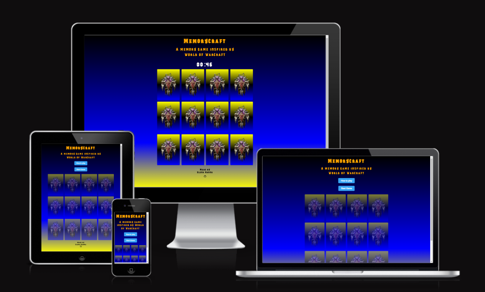
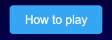
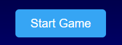
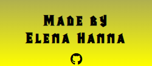
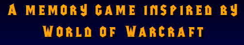
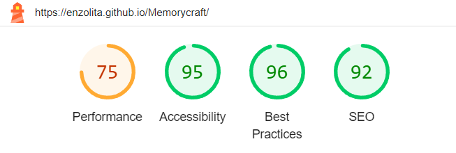

# Memorycraft
### A world of warcraft inspired memory game for all wow fans out there.
### Memory games are a valuable tool for enhancing mental functions, promoting learning, and providing enjoyable and beneficial challenges for people of all ages.

   - Score points by matching all pairs.
   - Win the game by matching all of them.
   - Have fun!

## [Live site](https://enzolita.github.io/Memorycraft/)

# Features

**Main Header**

  - A fully responsive header that that allows users to refresh the page when being clicked on, it also has a hover effect that makes it change color and pointer.

  

Header Screenshot

  
  
  

**How to play Button**

  - A button that provides the user with how to play information about the game.

  

How to play button Screenshot

  

  

**Start Game Button**

  - A start game button that starts the game and allows you to play when clicked.
  - Includes a countdown timer.
   - When clicked starts the memory game.
   - When countdown reaches zero it will say you lost.
   - If game is won it will say you win!

  

Start Game Button Screenshot

 

  

  - **Memory Board**

- Frontside pictures of the horde logo.
- Flip animation when clicked.
- Shows how many matches you've gotten so far.
- On the backside are pictures of different horde factions.  

**The Footer**

  - A paragraph with 
  - The footer leads the user to the project's repository when the Github icon is being clicked on.
 

  

Footer Screenshot

  

  

 

# Design

 **Fonts**

The custom-made font that was used for this project was mainly chosen to let it resemble world of warcraft.
- Readability - I found this font ensured the content remained easy to read an digest across all resolutions.
- Versatility - Raleway and Poppins adapt well to various contexts without sacrificing readability.
- Distinctiveness - Raleway font came across very elegant and refined, whereas Poppins contributes a more friendly and approachable vibe.

  

Font Screenshot

  

  

**Images**

I used some free source images from deviantart for multiple reasons,
- Firstly, these images provide visual context, aligning perfectly with the theme or content of the project.
- Secondly, by choosing high-quality images from deviantart, I ensure a professional and polished appearance, enhancing the overall aesthetic appeal of the project.
- Finally, I chose images that I felt would resonate with my audience.

**Colors**

- The colors orange and black were mainly chosen for the theme.
- Black and orange were used across the project primarily for text or to improve readability.
- Finally text shadow was used across the project in moments were contrast was an issue for example light background and light color text.

 

## Future Features
While the current version of the project is fully functional, we have some exciting features planned for future updates. Here are a few ideas that we didn't have time to implement in this release:

1. **Leaderboard**:
   - Allow photographers to create private galleries for clients to view and download their photos securely.
2. **Sound**:
   - Implement a booking system that allows clients to schedule sessions with photographers, choose dates, and make payments online.
3. **Difficulty level**:
   - Integrate basic photo editing tools like cropping, rotating, and applying filters directly on the website to enhance user-generated photos.
4. **Print Ordering**:
   - Enable clients to order prints, canvases, or other products featuring their favorite photos directly from the website.
5. **Portfolio Builder**:
   - Provide photographers with tools to easily create and customize their online portfolios, including options for different styles and layouts.
6. **Blog or News Section**:
   - Add a blog or news section to share photography tips, behind-the-scenes stories, and updates about your services.

## Manual Testing 

#### Features Testing

|  Feature |  Action | Effect |
|---|---|---|
|Header|When clicked|Brings back to Home page|
|Header|When hovered over|Lights up with a red color|
|Start Game Button|When clicked|Starts the memory game
|Reset Game Button|When clicked|Refreshes the page|
|Contact Page|Fill out the form and submit|A form dump is rendered|
||Attempt to submit empty|Error pops up in field that's left empty|
|Social Media Links|Test Github link|Github repository opens in a separate tab|

  

#### Lighthouse

**Introduction**
This report presents the results of Lighthouse testing conducted to assess the performance, accessibility, best practices, SEO, and PWA compliance of [Website Name].

**Test Execution**
Lighthouse tests were executed using the Google Chrome browser's DevTools.

**Test Metrics**
- Performance Score: 75
- Accessibility Score: 95
- Best Practices Score: 96
- SEO Score: 92

**Detailed Results**
- **Performance**: The website's performance score is 81, indicating good overall performance. However, there is room for improvement to further optimize loading times.
<!---minor issues accessibility with contrast-->
- **Accessibility**: The website excels in accessibility, with a score of 93, indicating strong adherence to accessibility standards. Minimal accessibility issues were detected.
- **Best Practices**: The website follows best practices with a score of 92. There are minor areas for improvement, particularly in script loading.
- **SEO**: SEO performance is strong, with a score of 92. The website has well-optimized meta tags and structured data markup.

**Areas for Improvement**
<!-- change images to webp to improve perfpormance-->
- Performance can be enhanced by optimizing resource loading and reducing unnecessary requests.
- Continue monitoring accessibility to maintain a high standard and address any emerging issues.
- Best practices can be further improved by optimizing script loading and code splitting.
- Maintain and regularly update meta tags and structured data markup to ensure strong SEO performance.

**Visuals**

#### Browsers

**Supported Browsers and Devices**
The web application is officially tested and supported on the following browsers and devices:
- Google Chrome (latest version)

**Responsiveness Testing**
We conduct manual responsiveness testing on Chrome to ensure a seamless user experience.

**Test Results**

#### Screen Sizes testing

| Device/Screen Size  | Chrome Performance | Firefox Performance |
|----------------------|--------------------|---------------------|
| Desktop (1920x1080) | Describe performance and issues on Chrome | Describe performance and issues on Firefox |
| Laptop (1366x768)   | Describe performance and issues on Chrome | Describe performance and issues on Firefox |
| Tablet (iPad)       | Describe performance and issues on Chrome | Describe performance and issues on Firefox |
| Mobile (iPhone X)   | Describe performance and issues on Chrome | Describe performance and issues on Firefox |

**Known Issues**
- [List any known responsiveness issues or limitations]

**Recommendations**
If you encounter any responsiveness issues, we recommend:
- Updating your browser to the latest version.
- Trying an alternative device or screen size for optimal viewing.

#### Screen Sizes testing

**Introduction**
This section provides an overview of how our web application [Website Name] performs across different screen sizes.

**Supported Screen Sizes**
Our web application is designed to be responsive and adapt to various screen sizes. Below are the screen sizes we have tested:

| Screen Size     | Description             |
|-----------------|-------------------------|
| Desktop         | 1920x1080 pixels        |
| Laptop          | 1366x768 pixels         |
| Tablet (iPad)   | 768x1024 pixels (portrait) and 1024x768 pixels (landscape) |
| Mobile (iPhone) | 375x812 pixels (iPhone X, portrait) and 812x375 pixels (iPhone X, landscape) |

**Testing Results**

| Screen Size     | Test Results           |
|-----------------|------------------------|
| Desktop         | Describe performance and issues on different browsers |
| Laptop          | Describe performance and issues on different browsers |
| Tablet (iPad)   | Describe performance and issues on different browsers |
| Mobile (iPhone) | Describe performance and issues on different browsers |

 

#### Validator Testing 
- HTML
  - No errors were returned when passing through the official [W3C validator](https://validator.w3.org/nu/?doc=https%3A%2F%2Fcode-institute-org.github.io%2Flove-running-2.0%2Findex.html)
- CSS
  - No errors were found when passing through the official [(Jigsaw) validator](https://jigsaw.w3.org/css-validator/validator?uri=https%3A%2F%2Fvalidator.w3.org%2Fnu%2F%3Fdoc%3Dhttps%253A%252F%252Fcode-institute-org.github.io%252Flove-running-2.0%252Findex.html&profile=css3svg&usermedium=all&warning=1&vextwarning=&lang=en#css)

## Deployment

- The site was deployed to GitHub pages. The steps to deploy are as follows: 
  - In the GitHub repository, navigate to the Settings tab 
  - From the source section drop-down menu, select the Main Branch
  - Once the main branch has been selected, the page will be automatically refreshed with a detailed ribbon display to indicate the successful deployment. 

The live link can be found here - https://enzolita.github.io/Memorycraft/ 

## Credits 

In this section you need to reference where you got your content, media and extra help from. 
It is common practice to use code from other repositories and tutorials, however, it is important to be very specific about these sources to avoid plagiarism. 

You can break the credits section up into Content and Media, depending on what you have included in your project. 

#### Content 

- The text for the Home page was taken from Wikipedia Article A
- The development of this project was aided by the following YouTube tutorials:

| Tutorial Title      | Creator/Channel Name | Description                                          |
|---------------------|-----------------------|------------------------------------------------------|
| [Tutorial Title 1](link-to-tutorial) | [Creator/Channel Name 1] | How this tutorial helped you.             |
| [Tutorial Title 2](link-to-tutorial) | [Creator/Channel Name 2] | How this tutorial contributed to your project. |

- The icons in the footer were taken from [Font Awesome](https://fontawesome.com/)

#### Media

The following images used in this project are sourced from Unsplash and are used under their respective licenses: