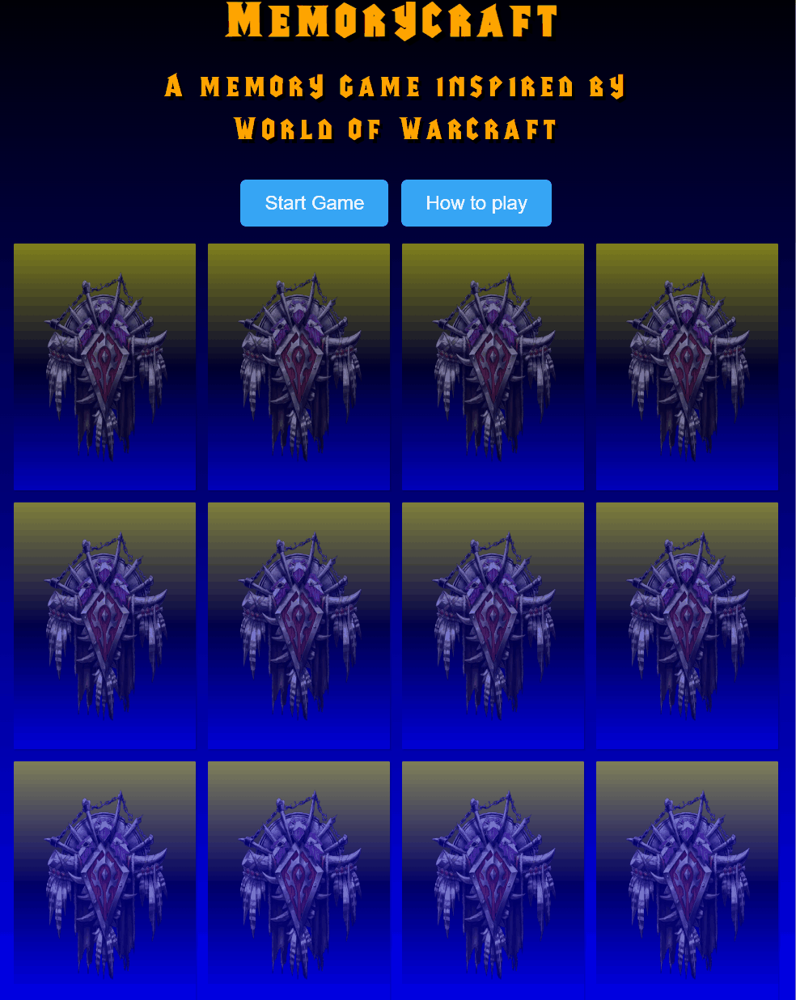

# Memorycraft
### A world of warcraft inspired memory game for all wow fans out there.
### Memory games are a valuable tool for enhancing mental functions, promoting learning, and providing enjoyable and beneficial challenges for people of all ages.

   - Score points by matching all pairs.
   - Win the game by matching all of them.
   - Have fun!

## [Live site](https://enzolita.github.io/Memorycraft/)

# Features

**Main Header**

  - A fully responsive header that that allows users to refresh the page when being clicked on, it also has a hover effect that makes it change color and pointer.

  

Header Screenshot

  
  
  

**How to play Button**

  - A button that provides the user with how to play information about the game.

  

How to play button Screenshot

  

  

**Start Game Button**

  - A start game button that starts the game and allows you to play when clicked.
  - Includes a countdown timer.
   - When clicked starts the memory game.
   - When countdown reaches zero it will say you lost.
   - If game is won it will say you win!

  

Start Game Button Screenshot

 

  

**Memory Board**

- Frontside pictures of the horde logo with low opacity.
- Flip animation when clicked.
- On the backside are pictures of different horde factions with normal opacity.
   
   

Memory Board Screenshot

**Reset Game**

- Reset game button that refreshes the page so the user can restart the game. 

**The Footer**

  - The footer leads the user to the project's repository when the Github icon is being clicked on.
 

  

Footer Screenshot

  

  

 

# Design

 **Fonts**

The custom-made font that was used for this project was mainly chosen to let it resemble world of warcraft.
- Readability - I found this font ensured the content remained easy to read an digest across all resolutions.
- Versatility - Warcraft and default adapt well to various contexts without sacrificing readability.
- Distinctiveness - Warcraft font came across very elegant and refined, whereas default contributes a more friendly and approachable vibe.

  

Font Screenshot

  

  

**Images**

I used some free source images from deviantart for multiple reasons,
- Firstly, these images provide visual context, aligning perfectly with the theme or content of the project.
- Secondly, by choosing high-quality images from deviantart, I ensure a professional and polished appearance, enhancing the overall aesthetic appeal of the project.
- Finally, I chose images that I felt would resonate with my audience.

**Colors**

- The colors orange and black were mainly chosen for the theme.
- Black and orange were used across the project primarily for text or to improve readability.
- Finally text shadow was used across the project in moments were contrast was an issue for example light background and light color text.

 

## Future Features
While the current version of the project is fully functional, we have some exciting features planned for future updates. Here are a few ideas that we didn't have time to implement in this release:

1. **Leaderboard**:
   - A leaderboard that shows the users score.
2. **Sound**:
   - A sound that appears when clicking on the cards.
3. **Difficulty level**:
   - Different difficulty levels to choose between.

## Manual Testing 

#### Features Testing

|  Feature |  Action | Effect |
|---|---|---|
|Header|When clicked|Brings back to Home page|
|Header|When hovered over|Lights up with a red color|
|Start Game Button|When clicked|Starts the memory game
|Reset Game Button|When clicked|Refreshes the page|
|Social Media Links|Test Github link|Github repository opens in a separate tab|

## Responsiveness

 - I leveraged the developer tools to test the responsiveness of the project across different resolutions.

#### Lighthouse

**Introduction**
This report presents the results of Lighthouse testing conducted to assess the performance, accessibility, best practices, SEO, and PWA compliance of [Website Name].

**Test Execution**
Lighthouse tests were executed using the Google Chrome browser's DevTools.

**Test Metrics**
- Performance Score: 75
- Accessibility Score: 95
- Best Practices Score: 96
- SEO Score: 92

**Detailed Results**
- **Performance**: The website's performance score is 81, indicating good overall performance. However, there is room for improvement to further optimize loading times.
<!---minor issues accessibility with contrast-->
- **Accessibility**: The website excels in accessibility, with a score of 93, indicating strong adherence to accessibility standards. Minimal accessibility issues were detected.
- **Best Practices**: The website follows best practices with a score of 92. There are minor areas for improvement, particularly in script loading.
- **SEO**: SEO performance is strong, with a score of 92. The website has well-optimized meta tags and structured data markup.

**Areas for Improvement**
<!-- change images to webp to improve perfpormance-->
- Performance can be enhanced by optimizing resource loading and reducing unnecessary requests.
- Continue monitoring accessibility to maintain a high standard and address any emerging issues.
- Best practices can be further improved by optimizing script loading and code splitting.
- Maintain and regularly update meta tags and structured data markup to ensure strong SEO performance.

**Visuals**

#### Browsers

**Supported Browsers and Devices**
The web application is officially tested and supported on the following browsers and devices:
- Google Chrome (latest version)

**Responsiveness Testing**
We conduct manual responsiveness testing on Chrome to ensure a seamless user experience.

**Test Results**

#### Screen Sizes testing

| Device/Screen Size  | Chrome Performance |
|----------------------|--------------------|
| Desktop (1920x1080) | Performs as expected | Describe performance and issues on Firefox |
| Laptop (1366x768)   | Performs as expected | Describe performance and issues on Firefox |
| Tablet (iPad)       | Performs as expected | Describe performance and issues on Firefox |
| Mobile (iPhone X)   | Performs as expected | Describe performance and issues on Firefox |

#### Screen Sizes testing

**Introduction**
This section provides an overview of how the web application Memorycraft performs across different screen sizes.

**Supported Screen Sizes**
The web application is designed to be responsive and adapt to various screen sizes. Below are the screen sizes we have tested:

| Screen Size     | Description             |
|-----------------|-------------------------|
| Desktop         | 1920x1080 pixels        |
| Laptop          | 1366x768 pixels         |
| Tablet (iPad)   | 768x1024 pixels (portrait) and 1024x768 pixels (landscape) |
| Mobile (iPhone) | 375x812 pixels (iPhone X, portrait) and 812x375 pixels (iPhone X, landscape) |

#### Validator Testing 
- HTML
  - No errors were returned when passing through the official [W3C validator](https://validator.w3.org/nu/?doc=https%3A%2F%2Fcode-institute-org.github.io%2Flove-running-2.0%2Findex.html)
- CSS
  - No errors were found when passing through the official [(Jigsaw) validator](https://jigsaw.w3.org/css-validator/validator?uri=https%3A%2F%2Fvalidator.w3.org%2Fnu%2F%3Fdoc%3Dhttps%253A%252F%252Fcode-institute-org.github.io%252Flove-running-2.0%252Findex.html&profile=css3svg&usermedium=all&warning=1&vextwarning=&lang=en#css)

## Deployment

- The site was deployed to GitHub pages. The steps to deploy are as follows: 
  - In the GitHub repository, navigate to the Settings tab 
  - From the source section drop-down menu, select the Main Branch
  - Once the main branch has been selected, the page will be automatically refreshed with a detailed ribbon display to indicate the successful deployment.

## Credits 

#### Media

- Images are sourced from: https://www.deviantart.com/1j9e8p7/art/World-Of-Warcraft-Icons-119251870
- Social media icons are sourced from: Font Awesome.
- Fonts (Warcraft) are sourced from: (https://www.cdnfonts.com/warcraft.font)

#### Code

- Overall inspiration was taken from the game World of Warcraft.
- Inspiritaion for the memory game was taken from a video by Code Sketch: https://www.youtube.com/watch?v=eMhiMsEC9Uk&list=PLLX1I3KXZ-YH-woTgiCfONMya39-Ty8qw

#### Acknowledgements

- The Code Institute Slack community offered valuable insight during the development of this project.
- My mentor Jubril offering and sharing his experience and feedback during the development of this project.
